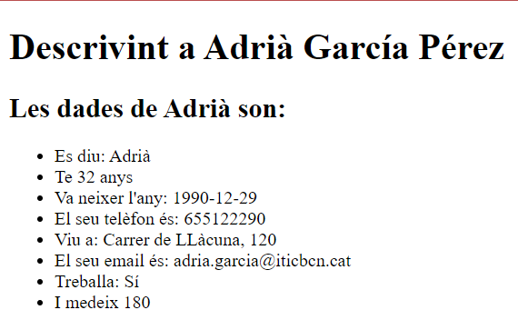

# Pràctica 1B
### Nom: Adrià García
### Classe: DAW2A
1. **Crear una copia de la pràctica anterior amb la diferència que, aquest cop, s'extreu la informació de la persona que estarà ubicada en una array.**
    <ul>
        <li>Recordar que l’array es definirà dintre de la lògica de PHP (<?php   ?>)</li>
        <li>Recordar posar, després de la lògica php, la impressió de totes les dades de la persona. Aquesta impressió es fa dintre de cada etiqueta.</li>
    </ul>
    Resposta d’exemple:
    
>>>
