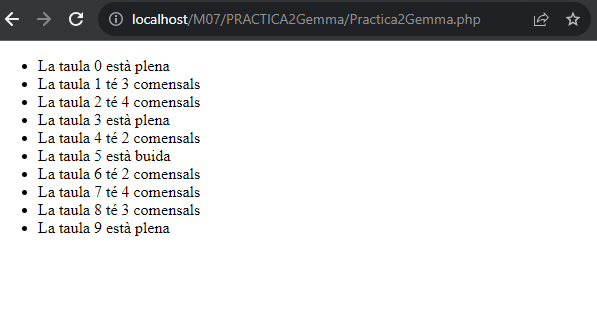
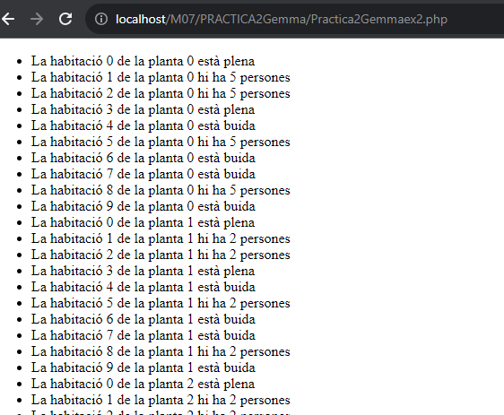

 
# PRACTICA 2

Volem gestionar un hotel, en concret, les taules del restaurant i les habitacions de l'hotel. 
S'ha de realitzar cada exercici en php amb HTML.

1. El restaurant estarà format per 10 taules, on cada taula hi caben fins a 5 comensals. Volem una sortida al terminal tal que: 

Recomanació: Feu, individualment o per parelles, el plantejament, sense codi, de la possible solució de l’exercici. Afegir una foto a captures de pantalla d’aquesta solució plantejada. (10 minuts)  

